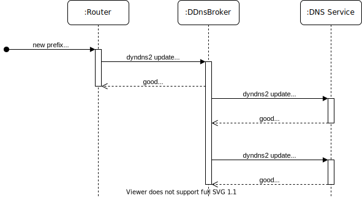

# DDnsBroker

DDnsBroker is a web server, that accepts dynamic dns updates and redistributes them to the real DNS update service(s).
The benefit of using DDnsBroker in between your clients and the DNS provider is that DDnsBroker can produce multiple dns updates from one request.
For example, a router could send one update of its LAN IPv6 address, and DDnsBroker would update several hosts of its network.



Currently DDnsBroker uses the dyndns2 protocol for its update interface and to update records.

Please note: While this software is functional, it is in a very early stage and may contain bugs.

## Getting Started

These instructions will get you a copy of the project up and running on your local machine for development and testing purposes.
See deployment for notes on how to deploy the project on a live system.

### Prerequisites

You need ``python3``, ``pip`` and ``virtualenv`` are also recommended. You can install it as follows:

```bash
sudo apt install python3 python3-venv        # Debian/Ubuntu
sudo dnf install python3 python3-virtualenv  # Fedora
sudo pacman -S python python-virtualenv      # Arch
```

### Installing

A step by step series of examples that tell you how to get a development env running.

First clone the repo and enter the folder.

```bash
git clone https://github.com/jomority/ddnsbroker.git
cd ddnsbroker
```

Then, create a virtual environment, activate it and upgrade pip.

```bash
python3 -m venv env
source env/bin/activate
pip install --upgrade pip
```

Finally, install DDnsBroker in editable mode and create its initial configuration.

```bash
pip install -e .
python3 manage.py migrate
python3 manage.py createsuperuser
```

Run the development server locally.

```bash
python3 manage.py runserver
```

You can now configure DDnsBroker from the admin interface (<http://127.0.0.1:8000/admin>) and send dynamic updates to its dyndns2 interface, e.g., <http://127.0.0.1:8000/nic/update?hostname=loc01.example.com&myip=192.0.2.64&myip=2001:db8:1234:5678::>.

### Configuration

#### Host

Parameters, that a host uses to update its IP address(es) via the dyndns2 interface

| Key           | Description                                           | Example                   |
| ------------- | ----------------------------------------------------- | ------------------------- |
| FQDN          | Gets used as hostname and user for the dyndns2 update | `loc01.example.com`       |
| Secret        | The secret for the dyndns2 update (is saved as hash)  | `1AM4S3CR3T`              |
| IPv4 enabled  | Whether IPv4 updates are accepted                     | ` `                       |
| IPv6 enabled  | Whether IPv6 updates are accepted                     | `✓`                       |
| IPv4          | The current IPv4, can be changed manually             | `192.0.2.64`              |
| IPv6          | The current IPv6, can be changed manually             | `2001:db8:1234:5678::`    |

#### Record

A record, that will be updated at an external DNS service

| Key                   | Description                                                           | Example                   |
| --------------------- | --------------------------------------------------------------------- | ------------------------- |
| Host                  | The corresponding host                                                | `loc01.example.com`       |
| FQDN                  | The hostname for the dyndns2 update                                   | `srv01.loc01.example.com` |
| IPv4 enabled          | Whether an update is sent when the IPv4 changes                       | ` `                       |
| IPv6 enabled          | Whether an update is sent when the IPv6 changes                       | `✓`                       |
| IPv4 netmask          | Used with IPv4 of the host and host identifier to calculate real IPv4 | `32`                      |
| IPv4 host identifier  | Used with IPv4 of the host and netmask to calculate real IPv4         | `0.0.0.0`                 |
| IPv6 netmask          | Used with IPv6 of the host and host identifier to calculate real IPv6 | `64`                      |
| IPv6 host identifier  | Used with IPv6 of the host and netmask to calculate real IPv6         | `::cafe`                  |
| Service               | The service that is used to update the record                         | `he.net`                  |
| Username              | The username used for the update                                      | `srv01.loc01.example.com` |
| Password              | The password used for the update                                      | `53CR3TUPD4T3P455`        |

#### Update service

A real DNS service, that accepts updates via dyndns

| Key               | Description                                       | Example                               |
| ----------------- | ------------------------------------------------- | ------------------------------------- |
| Name              | The human readable name                           | `he.net`                              |
| URL               | The dyndns2 interface URL                         | `https://dyn.dns.he.net/nic/update`   |
| Username is FQDN  | Whether the dyndns2 username is the record FQDN   | `✓`                                    |

## Deployment

For deployments, also read up on the [Django documentation](https://docs.djangoproject.com/en/3.0/howto/deployment/).

In the following paragraph an example will be given using nginx, uWSGI, systemd and a service user named ddnsbroker.
Of course, in the real world you should use HTTPS and maybe a real database.

Prepare the environment.

```bash
sudo -i -u ddnsbroker
mkdir /path/to/your/project
cd /path/to/your/project
python3 -m venv env
source env/bin/activate
pip install --upgrade pip
pip install git+https://github.com/jomority/ddnsbroker.git@master
pip install uwsgi
```

Create a `local_settings.py` file.

```python
from ddnsbroker.settings import *

SECRET_KEY = 'TOTALLY_SECRET_KEY_THAT_I_WILL_NOT_PUT_IN_VCS'

DEBUG = False

ALLOWED_HOSTS = ['127.0.0.1', '[::1]']

STATIC_ROOT = 'static'

# for postgresql, mysql and others see https://docs.djangoproject.com/en/3.0/ref/settings/#databases
DATABASES = {
    'default': {
        'ENGINE': 'django.db.backends.sqlite3',
        'NAME': 'db.sqlite3',
    }
}

# see https://docs.djangoproject.com/en/3.0/topics/logging/#configuring-logging
# LOGGING =

TIME_ZONE = 'Europe/Berlin'
```

Create initial configuration and collect static files in `STATIC_ROOT`.

```bash
PYTHONPATH=. DJANGO_SETTINGS_MODULE=local_settings django-admin migrate
PYTHONPATH=. DJANGO_SETTINGS_MODULE=local_settings django-admin createsuperuser
PYTHONPATH=. DJANGO_SETTINGS_MODULE=local_settings django-admin collectstatic
```

Create systemd service file at `/etc/systemd/system/ddnsbroker.service`.

```
[Unit]
Description=uWSGI instance to serve ddnsbroker
After=network.target
Before=nginx.service
# After=mariadb.service
# Requires=mariadb.service

[Service]
User=ddnsbroker
Group=ddnsbroker
WorkingDirectory=/path/to/your/project
ExecStart=/path/to/your/project/env/bin/uwsgi --module=ddnsbroker.wsgi:application --env DJANGO_SETTINGS_MODULE=local_settings --home=env  --threads 4 --socket="[::1]:8000"

[Install]
WantedBy=multi-user.target
```

Create nginx configuration at `/etc/nginx/sites-available/ddns`.

```nginx
server {
	listen 80;
	listen [::]:80;

	server_name ddns.example.com ipv6.ddns.example.com ipv4.ddns.example.com;

	add_header Content-Security-Policy "default-src 'none'; script-src 'unsafe-inline' 'self'; img-src 'unsafe-inline' 'self'; style-src 'unsafe-inline' 'self'; font-src 'self'; frame-ancestors 'none'; base-uri 'self'; form-action 'self';" always;

	location / {
		include uwsgi_params;
		uwsgi_pass [::1]:8000;
	}

	location /static {
		alias /path/to/your/project/static;
	}
}
```

Start everything up.

```bash
sudo systemctl daemon-reload
sudo systemctl enable --now ddnsbroker.service
sudo systemctl restart nginx.service
```

## Built With

* [Django](https://www.djangoproject.com/) - high-level Python Web framework

## Contributing

You are more than welcome to report bugs and submit pull requests to this project.

## Authors

* **Moritz Jordan** - *Initial work* - [jomority](https://github.com/jomority)

See also the list of [contributors](https://github.com/jomority/ddnsbroker/contributors) who participated in this project.

## License

This project is licensed under the MIT License - see the [LICENSE](LICENSE) file for details.

## Acknowledgments

* Thanks to the [nsupdate.info](https://github.com/nsupdate-info/nsupdate.info) project for the inspiration
